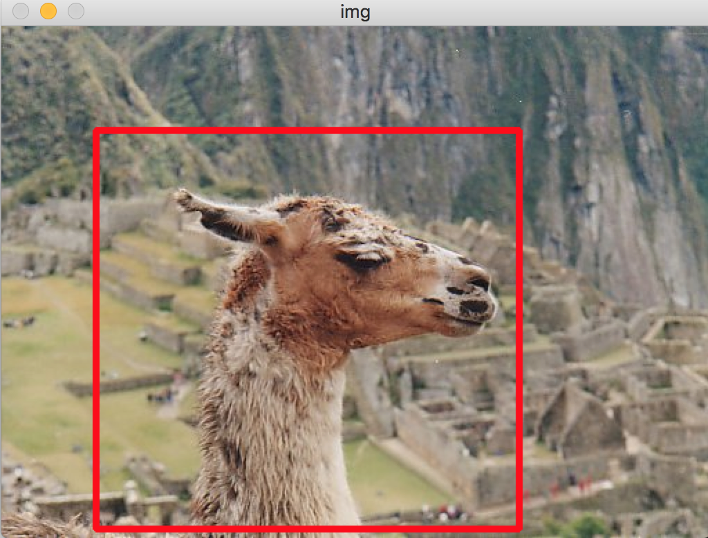
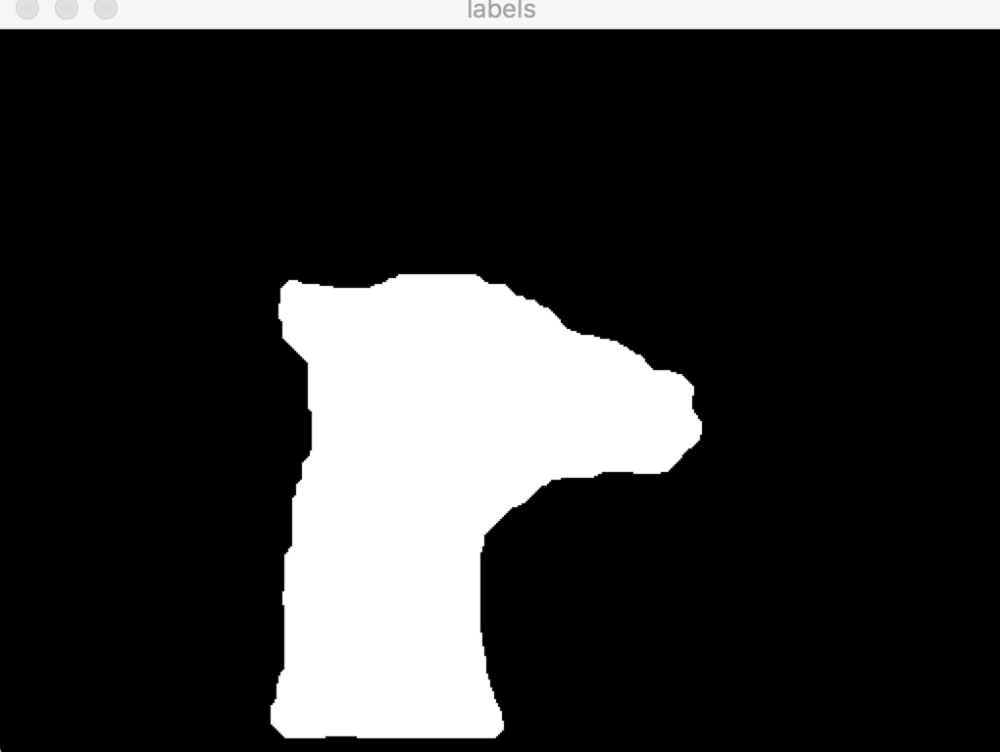

# GrabCut

A from-scratch C++ implementation of **GrabCut** interactive foreground segmentation, following ["GrabCut": Interactive Foreground Extraction Using Iterated Graph Cuts (SIGGRAPH 2004)](https://dl.acm.org/doi/10.1145/1015706.1015720) by Rother, Kolmogorov, and Blake — OpenCV is used only for image I/O and the GUI, not for its built-in `grabCut`.

## How It Works

- **User interaction** — drag a rectangle around the object; everything outside is hard-labeled background.
- **GMM color models** (`grabcut.cpp`) — a k = 5 component Gaussian mixture each for foreground and background, initialized by from-scratch **k-means** over the rectangle interior/exterior.
- **Iterated graph cuts** — the paper's three-step loop: assign each pixel to its best GMM component, re-estimate the mixture parameters from the current segmentation, then solve the segmentation as a min-cut with GMM data terms and contrast-sensitive 8-neighborhood smoothness terms.
- **Max-flow** (`graph.h`, `maxflow.cpp`, `block.h`) — the bundled [Boykov–Kolmogorov max-flow library](https://pub.ist.ac.at/~vnk/software.html) (BK 3.x), the same solver used in the original paper.

The repo bundles the standard **GrabCut benchmark images** (`GrabCut/data_GT`) and their ground-truth segmentations (`GrabCut/seg_GT`) from the Microsoft Research dataset.

## Usage

An Xcode project is included (macOS, requires OpenCV); the sources are plain C++ and easy to build elsewhere. Run the binary with the working directory set so `./data_GT/person2.bmp` resolves (or edit the image path in `main.cpp`), drag a rectangle on the image window, and watch the intermediate component/label maps as the iterations converge.

## Results




## References

```bibtex
@article{rother2004grabcut,
  title={"GrabCut": Interactive Foreground Extraction Using Iterated Graph Cuts},
  author={Rother, Carsten and Kolmogorov, Vladimir and Blake, Andrew},
  journal={ACM Transactions on Graphics (SIGGRAPH)},
  volume={23},
  number={3},
  pages={309--314},
  year={2004}
}

@article{boykov2004experimental,
  title={An Experimental Comparison of Min-Cut/Max-Flow Algorithms for Energy Minimization in Vision},
  author={Boykov, Yuri and Kolmogorov, Vladimir},
  journal={IEEE Transactions on Pattern Analysis and Machine Intelligence},
  volume={26},
  number={9},
  pages={1124--1137},
  year={2004}
}
```
